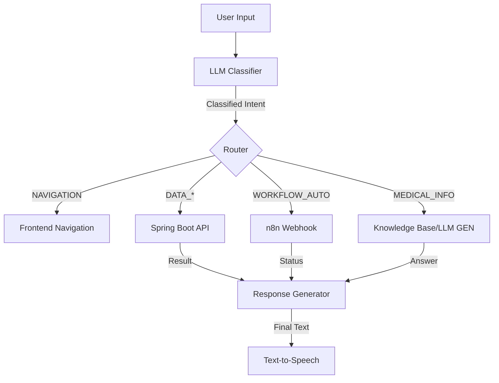

# AI Brain Design: Intent & Reasoning Engine
> **Component**: AI Voice Assistant  
> **Module**: NLP / Decision Engine  
> **Author**: Antigravity (AI Architect)

## 1. Intent Categories

The AI Brain must classify every user utterance into one of these strict categories.

| Intent Classification | Description | Backend Action | n8n Action |
| :--- | :--- | :--- | :--- |
| **`NAVIGATION`** | User wants to switch screens. | Return JSON `{ nav: "/route" }` | - |
| **`DATA_RETRIEVAL`** | Fetching specific patient or report data. | Call `GET /api/...` | - |
| **`DATA_MODIFICATION`** | Creating/Editing records (Notes, Patients). | Call `POST /api/...` | - |
| **`WORKFLOW_AUTO`** | Tasks involving external tools (Email, SMS). | - | **Trigger Webhook** |
| **`MEDICAL_INFO`** | General medical questions (Decision support). | RAG / LLM Answer | - |
| **`REPORT_ANALYSIS`** | Interpreting specific uploaded documents. | OCR + LLM Summary | - |

---

## 2. Prompt Engineering Strategy

We will use a **System Prompt** that acts as the "Constituency" of the AI.

### System Prompt Template
```text
You are 'Medico', a clinical decision support assistant. 
CURRENT USER ROLE: {user_role} (Doctor/Patient).

CORE RULES:
1. NEVER diagnose conditions. Only suggest possibilities based on standard guidelines.
2. IF user asks for medical advice, append: "This is not a diagnosis. Please consult a specialist."
3. OUTPUT FORMAT: Always return JSON.

AVAILABLE TOOLS:
- search_patient(name)
- add_patient_note(id, text)
- send_email(patient_id, subject)
- explain_term(term)

TASK:
Analyze the user input: "{user_input}"
Map it to the correct Intent and Tool.
If it is a general question, provide the answer in the "response_text" field.
```

---

## 3. Decision Logic (The Routing Flow)



---

## 4. Sample Prompts & Responses

### Scenario A: Doctor wants automation
**User**: "Send the latest lab report to John Doe via email."
**Context**: Role=Doctor
**LLM Output**:
```json
{
  "intent": "WORKFLOW_AUTO",
  "confidence": 0.98,
  "action": {
    "type": "n8n_webhook",
    "webhook_id": "send_email_report",
    "params": {
      "patient_name": "John Doe",
      "document_type": "lab_report"
    }
  },
  "voice_response": "I'm sending the lab report to John Doe now."
}
```

### Scenario B: Patient asks for explanation
**User**: "What does 'Elevated VS' mean in my report?"
**Context**: Role=Patient
**LLM Output**:
```json
{
  "intent": "MEDICAL_INFO",
  "confidence": 0.95,
  "response_text": "'Elevated VS' (Vital Signs) usually means one of your measurements like blood pressure, heart rate, or temperature is higher than normal ranges. However, this is general information. Please check with your doctor for your specific case.",
  "is_medical_advice": true
}
```

---

## 5. Medical Safety Guardrails

### 🛑 Rule 1: The "No Diagnosis" Hard Stop
If the input contains "Do I have [Disease]?" or "Is this cancer?", the System Prompt must force a refusal:
*   *Bad Response*: "Yes, your symptoms match cancer."
*   *Good Response*: "I cannot diagnose medical conditions. Your symptoms of X and Y can be associated with multiple conditions. Please schedule a consultation with a doctor for a proper evaluation."

### 🛡️ Rule 2: Role-Based Access Control (RBAC) in Semantics
*   **Patient** cannot say: "Delete my blood test result." -> LLM rejects intent: `UNAUTHORIZED_ACTION`.
*   **Doctor** can say: "Delete the duplicate record." -> LLM accepts intent.

### ⚠️ Rule 3: The "Review" Step
For `DATA_MODIFICATION` (e.g., Prescriptions), the Voice Assistant must **Read Back** the data before committing.
*   *User*: "Prescribe 500mg Amoxicillin."
*   *AI*: "I have prepared a prescription for 500mg Amoxicillin. Please confirm on screen to send." (Does NOT auto-submit).
