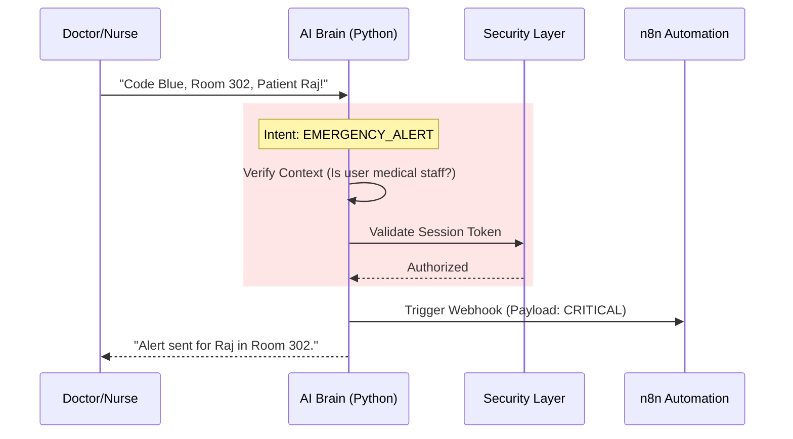

# Emergency Response Automation Design
> **System**: AI Medical Assistant  
> **Module**: Critical Event Dispatcher (CED)  
> **Author**: Antigravity (Healthcare Automation Specialist)

## 1. Voice-to-Intent Authorization Flow

The "Emergency" intent is privileged. It requires higher confidence and context verification.

---

## 2. n8n Workflow Steps (The "Red" Pipeline)

**Trigger**: Webhook `POST /webhook/emergency`

### Step 1: Data Enrichment (The "Context Gatherer")
*   **Input**: `{ "patient_name": "Raj", "location": "Room 302" }`
*   **Action**: Query Backend `GET /api/patients/search?name=Raj`
*   **Fetch**: 
    *   Blood Type
    *   Allergies (Critical!)
    *   Primary Physician Contact
    *   Recent Vitals (Last 4h)

### Step 2: Multi-Channel Broadcast (The "Megaphone")
Parallel execution ensures delivery even if one channel fails.
*   **Channel A (SMS/WhatsApp)**: Uses Twilio node.
    *   *Body*: "🚨 EMERG: Raj @ Room 302. Allergies: Penicillin. BP: 140/90."
*   **Channel B (Email)**: Uses SMTP node.
    *   *To*: `emergency-team@hospital.com`
    *   *Subject*: "URGENT: Code Blue - Room 302"
    *   *Body*: Full patient history attached.
*   **Channel C (Audit)**:
    *   *Action*: Write to `incident_logs` table in Postgres.

### Step 3: Confirmation Loop
*   **Action**: Wait for acknowledgment (Ack).
*   *Logic*: If no Ack within 60 seconds -> Escalation (Call Chief Resident).

---

## 3. Data Included in Alerts (The "Golden Minute" Data)

When a doctor receives an alert, they need immediate, actionable info. **Do not clutter.**

| Data Point | Purpose | Source |
| :--- | :--- | :--- |
| **Location** | Where to run. | Voice Input |
| **Patient Name/ID** | Identity verification. | Database |
| **Code Type** | Cardiac / Respiratory / Trauma. | Voice Input (Intent) |
| **Allergies** | Avoid fatal errors during treatment. | Database (Critical Field) |
| **Do Not Resuscitate (DNR)** | Legal status for life support. | Database (Flags) |

---

## 4. Fail-Safe Mechanisms

What if the internet breaks?

1.  **Local Fallback**: 
    *   The Python AI Service monitors the `n8n` webhook response.
    *   If n8n returns `500` or `Timeout`:
        *   **Action**: Python Service logs error to local disk and plays loud audio alarm on the device itself: *"Network Alert Failed. Please Call Manually."*
2.  **Redundant Channels**:
    *   SMS is primary (Telephony network).
    *   Push Notification (WiFi) is secondary.
3.  **Human Loop**:
    *   The Voice Assistant **always** confirms success: *"Alert Sent."*
    *   If it implies silence, the user knows it failed.

---

## 5. Ethical & Legal Considerations

1.  **False Positives**:
    *   *Risk*: AI mishears "Code Blue" when doctor said "Code Blue shoes".
    *   *Mitigation*: Confidence Threshold > 0.9. If 0.8-0.9, ask "Confirm Code Blue?"
2.  **Liability**:
    *   The system is a **Notifier**, not a Decision Maker.
    *   *Disclaimer*: "Automated msg. Verify status."
3.  **Privacy (HIPAA)**:
    *   SMS messages should contain **minimum necessary PII**.
    *   *Better*: "Emergency Room 302. Check App for Details." (Avoids sending Name+Condition over SMS).
    *   *Project Context*: Since this is a demo/student project, we will send full details for clarity, but note this limitation in the report.
