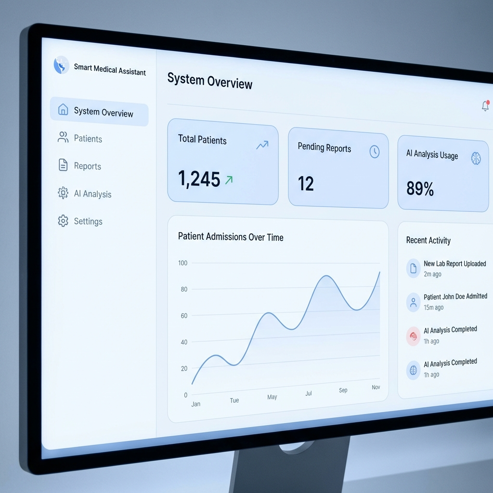
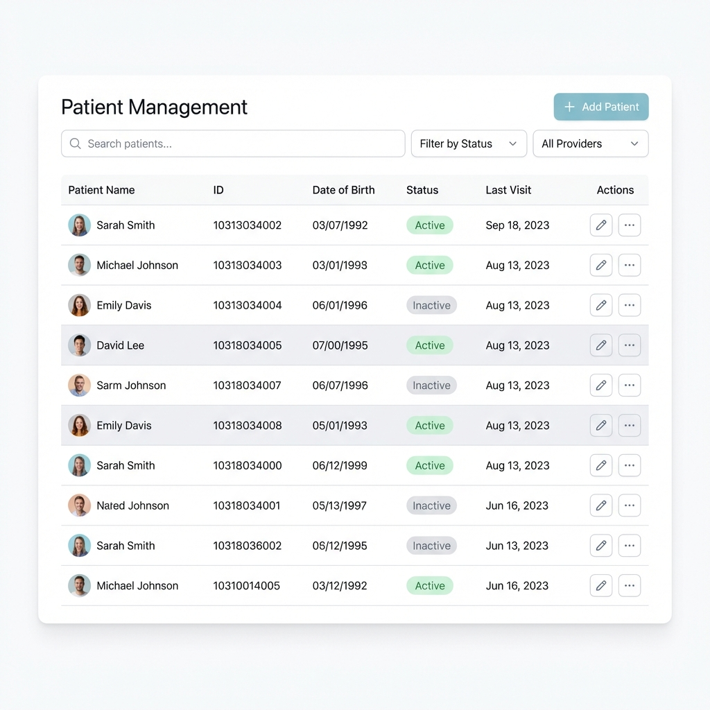
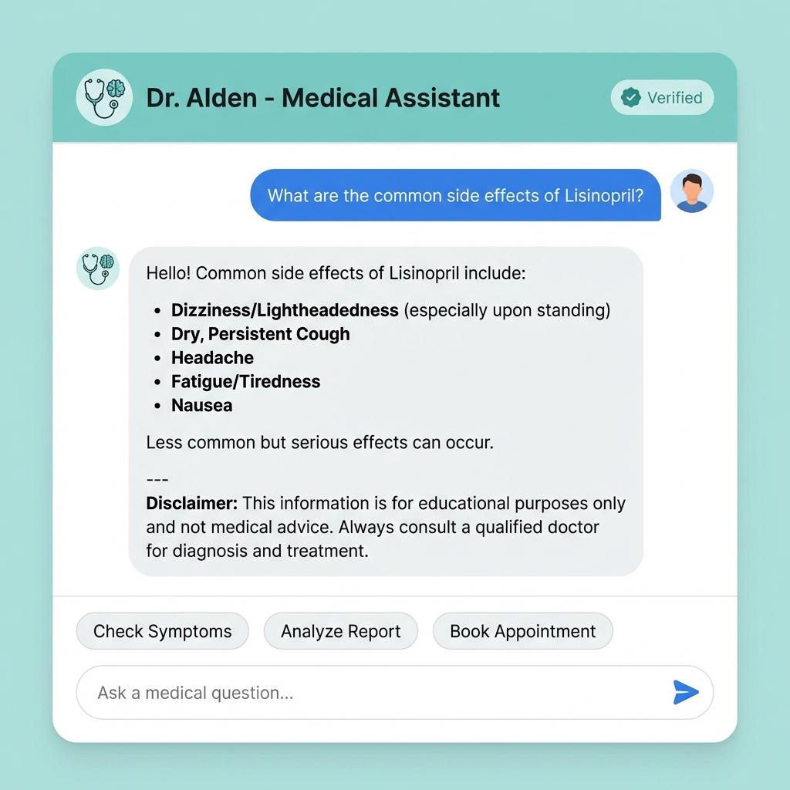

# 🏥 AI-Powered Smart Medical Assistant

   

> **A comprehensive, production-ready healthcare platform integrating patient management, secure medical records, and advanced AI clinical decision support.**

---
**⚠️ Important:** This software is for **demonstration and educational purposes only**. It is not cleared for clinical diagnosis or treatment.
---

## 📸 Application Preview

<p align="center">
  
  <br>
  <em>Real-time Operations Dashboard</em>
</p>

### Key Interfaces

| **Patient Management** | **AI Clinical Assistant** |
|:---:|:---:|
|  |  |
| *Efficient Record Tracking* | *Smart Decision Support* |

---

## ✨ Key Features

### 📋 Core Management
- **Patient & Doctor Portals**: Full CRUD capabilities with role-based access.
- **Medical Reports**: Secure upload (PDF/Image) with auto-categorization and storage.
- **Prescriptions**: Digital prescription management with history tracking.
- **Emergency Access**: "Break-the-glass" protocol for emergency data access with audit trails.

### 🧠 AI & Intelligence
- **Intelligent Report Analysis**: OCR and NLP (BioClinicalBERT) to extract entities from documents.
- **Symptom Checker**: AI-driven preliminary symptom analysis and triage suggestions.
- **Clinical Chatbot**: Interactive assistant for medical queries and drug interaction checks.
- **Continuous Learning**: Background fine-tuning pipeline for model improvement.

### 🛡️ Security & Infrastructure
- **Enterprise Security**: JWT Statless Auth, BCrypt hashing, and precise RBAC (Admin, Clinician, Auditor).
- **Event-Driven**: Kafka-based architecture for asynchronous document processing.
- **Observability**: Full ELK Stack (Logging), Prometheus (Metrics), and Grafana (Dashboards).

---

## 🛠️ Technology Stack

| Domain | Technologies |
|:---:|:---|
| **Backend** |    |
| **Frontend** |    |
| **AI / ML** |     |
| **Data & Ops** |    |

---

## 🚀 Quick Start

### Prerequisites
- Docker Desktop (Allocated 8GB+ RAM)
- Ports: `8080` (API), `3000` (UI), `8000` (AI)

### One-Command Setup (Recommended)
Run the automated startup script to launch the full stack:

```powershell
# Windows PowerShell
.\start-dev.ps1
```

Or using Docker Compose directly:

```bash
docker-compose up --build
```

### Access Points
- **Frontend Dashboard**: [http://localhost:3000](http://localhost:3000)
- **Backend API Docs**: [http://localhost:8080/swagger-ui.html](http://localhost:8080/swagger-ui.html)
- **AI Service Docs**: [http://localhost:8000/docs](http://localhost:8000/docs)
- **Grafana Monitoring**: [http://localhost:3000](http://localhost:3000) (User: `admin` / Pass: `admin`)

---

## 📖 Documentation Index

| Guide | Description |
|:---|:---|
| 📘 [Getting Started](START_HERE.md) | Comprehensive setup and first-run guide. |
| 🏗️ [Architecture](FRONTEND_ARCHITECTURE.md) | Deep dive into the frontend and system design. |
| 🔌 [API Integration](COMPLETE_INTEGRATION_GUIDE.md) | Detailed API endpoints and integration patterns. |
| 🗄️ [Database Schema](DATABASE_SCHEMA.md) | ER diagrams and effective schema structure. |
| 🐳 [Docker Setup](DOCKER_FRONTEND_SETUP.md) | Containerization and deployment details. |
| 🧪 [Testing Guide](test_ml_system.bat) | How to run ML system verification tests. |

---

## 📞 Support & License

For support, please open an issue in the repository. Valid for **MIT License**.

**Maintainers:**
- Rajratan PCU
