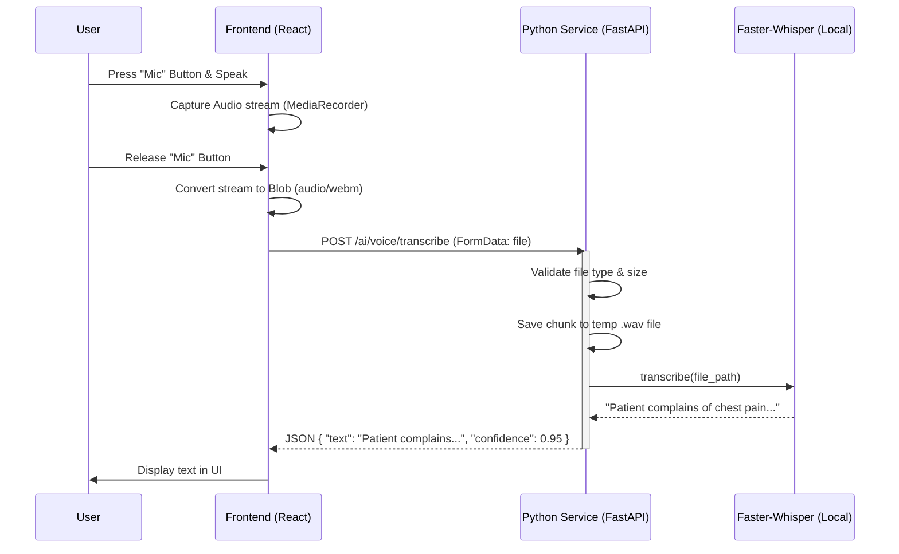

# Speech-to-Text (STT) Module Design
> **Component**: AI Voice Assistant  
> **Module**: STT Service (Hearing)  
> **Author**: Antigravity (AI Architect)

## 1. Technology Choice

### Recommendation: `faster-whisper` (Local Implementation)
We will use **OpenAI's Whisper model**, but implemented via the `faster-whisper` library (CTranslate2 backend).

#### Justification:
1.  **Accuracy**: Whisper is State-of-the-Art (SOTA) for general speech. Even the `small` model outperforms traditional engines on medical terms if they are clearly spoken.
2.  **Performance**: `faster-whisper` is up to 4x faster than the original OpenAI implementation and uses less memory. It can run on a decent CPU if a GPU is unavailable (common in student projects).
3.  **Privacy (Crucial for Medical)**: Everything runs **locally** on your Docker container. No patient audio is sent to the cloud (Google/Amazon/OpenAI APIs), which is a huge "Ethical AI" plus for your project.
4.  **Cost**: Free. No API keys required.

*Fallback Strategy*: If the local machine is too slow, we can easily switch to OpenAI API with a 1-line code change, but we start with Local for the project goals.

---

## 2. API Flow (The "Hearing" Pipeline)



---

## 3. Sample FastAPI Design

We will use `UploadFile` to receive the binary audio data.

### Endpoint Structure
**File**: `ai-service/app/routers/voice.py` (Proposed)

```python
from fastapi import APIRouter, UploadFile, File, HTTPException
from fastapi.responses import JSONResponse
import shutil
import os
from app.services.stt_engine import transcribe_audio

router = APIRouter()

@router.post("/transcribe")
async def transcribe_voice_command(file: UploadFile = File(...)):
    """
    Receives an audio blob (WebM/WAV), converts it to text using Whisper.
    """
    # 1. Validation
    if not file.filename.endswith(('.webm', '.wav', '.mp3')):
        raise HTTPException(status_code=400, detail="Invalid audio format")

    # 2. Save Temp File
    temp_filename = f"temp_{file.filename}"
    try:
        with open(temp_filename, "wb") as buffer:
            shutil.copyfileobj(file.file, buffer)
            
        # 3. Process with STT Engine
        text, info = transcribe_audio(temp_filename)
        
        # 4. Cleanup
        os.remove(temp_filename)
        
        return JSONResponse(content={
            "text": text,
            "language": info.language,
            "probability": info.language_probability
        })
        
    except Exception as e:
        # Log error securely (don't log PII)
        print(f"STT Error: {str(e)}")
        raise HTTPException(status_code=500, detail="Failed to process audio")
```

---

## 4. Error Handling Strategies

| Issue | Strategy |
| :--- | :--- |
| **Silent Audio** | Whisper hallucinating on silence. **Fix**: Use Voice Activity Detection (VAD) filter or check if transcribed text length < threshold. |
| **Background Noise** | Whisper is robust, but if confidence `< 0.6`, ask user to repeat: *"I didn't quite catch that."* |
| **Unsupported Format** | Frontend usually sends `audio/webm`. Use `ffmpeg` (via `pydub`) in python to normalize ANY input to `16khz mono wav` before sending to model. |
| **Server Overload** | If strictly CPU, queue requests. For MVP, just return 503 if busy. |

---

## 5. Privacy & Ethics Checklist

Since this is a medical app:

1.  **No Cloud Storage**: We delete the `temp_audio.wav` immediately after transcription (Lines 27-28 in code sample).
2.  **Encryption**: Ensure the Frontend -> Backend connection is HTTPS (or localhost for demo).
3.  **Disclaimer**: The UI must show a "Listening" indicator so the user knows exactly when they are being recorded.
4.  **Consent**: In a real app, you'd ask "Allow Microphone Access" (browser does this by default).
