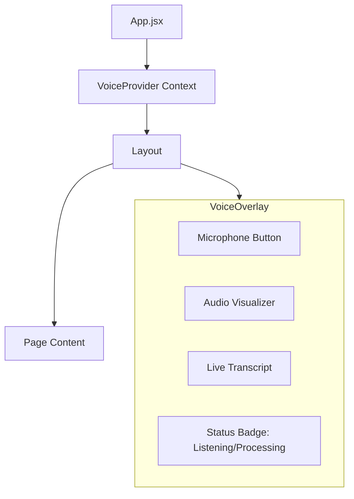

# Frontend Voice UI Design
> **Component**: React Frontend  
> **Module**: Voice Interaction Layer  
> **Author**: Antigravity (Frontend Voice Specialist)

## 1. Visual Design Philosophy: "Always Visible, Never Intrusive"

The voice assistant in a medical app should be a floating utility that is always accessible but doesn't block the patient record view.

### The "Floating Action Button" (FAB) Approach
*   **Default State**: A floating microphone icon in the bottom-right corner.
*   **Active State**: Expands into a "Dynamic Island" or bottom sheet showing transcription.

---

## 2. Component Structure

We will implement a `VoiceAssistant` context provider to manage state globally.



### Component breakdown
1.  **`VoiceProvider.jsx`**: Handles `MediaRecorder`, API calls to Python backend, and audio playback. Exposes `isListening`, `transcript`, `speak(text)`.
2.  **`VoiceVisualizer.jsx`**: CSS-based "sound wave" animation that reacts to volume amplitude.
3.  **`VoiceFloatingButton.jsx`**: The trigger UI.

---

## 3. User Interaction Flow

| State | Visual | Action |
| :--- | :--- | :--- |
| **Idle** | 🎙️ Gray Icon | Waiting for click. |
| **Listening** | 🔴 Pulsing Red + Waveform | Recording audio chunk. |
| **Processing** | 🔄 Spinning Blue Loader | Uploading blob -> STT -> Intent. |
| **Speaking** | 🔊 Green Speaker Icon | Playing backend response audio. |
| **Error** | ⚠️ Triangle + Toast | "Could not hear you. Try again." |

### Interaction Rules
1.  **Click-to-Toggle**: Click to start, Click again to stop (and send).
2.  **Silence Detection**: Auto-stop if silence > 3 seconds (optional for V2).
3.  **Keyboard Shortcut**: Press `Spacebar` (while held) to talk (Push-to-Talk).

---

## 4. UX Best Practices for Healthcare

1.  **Confidence Confirmation**:
    *   **Bad**: Executing "Delete Patient" immediately.
    *   **Good**: Show modal "Did you mean 'Delete Patient X'?" with [Yes/No] buttons.
2.  **Terminology Display**:
    *   When the AI says "Hypertension", display it on screen so the user validates the *medical spelling*.
3.  **Interruptibility**:
    *   If the AI is reading a long report, clicking the Mic button should immediately **Stop Audio** and start listening. Doctors don't like waiting for machines to finish talking.

---

## 5. Error & Fallback UI

*   **Microphone Permission Denied**:
    *   Show helpful tooltip: "Please allow microphone access in your browser address bar to use Voice features."
*   **No Speech Detected**:
    *   "I didn't hear anything. Please try speaking closer to the mic."
*   **Network Error**:
    *   "Voice service unavailable. Please text chat instead." (Switch to text input mode).

---

## 6. Implementation Snippet (VoiceProvider)

```javascript
// Quick logic preview
const startListening = async () => {
    try {
        const stream = await navigator.mediaDevices.getUserMedia({ audio: true });
        mediaRecorder.current = new MediaRecorder(stream);
        mediaRecorder.current.ondataavailable = (e) => chunks.push(e.data);
        mediaRecorder.current.start();
        setIsListening(true);
    } catch (err) {
        setError("Mic Access Denied");
    }
};

const stopListening = async () => {
    mediaRecorder.current.stop();
    setIsListening(false);
    // ... send chunks to API ...
};
```
