# PROPOSED ARCHITECTURE: AI Voice Assistant & n8n Automation
> **For:** AI-Powered Smart Medical Assistant  
> **Target Audience:** Final Year CS Project  
> **Author:** Antigravity (AI Architect)

## 1. High-Level System Overview

This architecture extends your existing Patient Management System by adding a **Voice Interface Layer** and a **Workflow Automation Layer (n8n)**. The goal is to allow doctors to perform tasks hands-free (e.g., "Add a note for Patient John Doe") and automate clear-cut administrative processes.

### Core Philosophy: "Keep the Core Clean, Automate the Edge"
- **Spring Boot (Backend):** Remains the "Source of Truth" for data. Secure, reliable, typed.
- **Python (AI Service):** The "Brain". Handles understanding language and making soft decisions (medical NLP).
- **n8n (Automation):** The "Hands". Connects the system to the outside world (Email, SMS, Calendars) and glues services together without writing new Java code for every notification rule.

---

## 2. End-to-End Architecture Diagram

```mermaid
graph TD
    subgraph Frontend Logic [React Client]
        Mic[🎙️ Microphone Input] -->|Blob| VoiceHandler
        VoiceHandler -->|POST /audio| AI_SVC
        AudioPlayer[🔊 Audio Player]
    end

    subgraph Intelligence Layer [Python FastAPI AI Service]
        AI_SVC[AI Service Gateway]
        STT[🗣️ Whisper STT Model]
        LLM[🧠 LLM Intent Classifier]
        TTS[🔈 Text-to-Speech Engine]
        
        AI_SVC --> STT
        STT -->|Text| LLM
        LLM -->|Decision: Query or Action?| router{Router}
    end

    subgraph Core Data [Spring Boot Backend]
        API[REST API]
        DB[(PostgreSQL)]
        API --> DB
    end

    subgraph Automation [n8n Workflow Engine]
        Webhooks[Webhook Triggers]
        Email[📧 Email Node]
        SMS[📱 SMS Node]
        Logic[If/Else Logic]
    end

    %% Flows
    router -->|Medical Q&A| KB[Medical Knowledge Base]
    KB -->|Answer| TTS
    
    router -->|Data Action| API
    API -->|Result| TTS
    
    router -->|External Workflow| Webhooks
    Webhooks --> Logic
    Logic --> API
    Logic --> Email
    Logic -->|Success/Fail| AI_SVC
    AI_SVC -->|Audio Response| AudioPlayer
```



---

## 3. Data Flow Explained (The "Voice Journey")

Here is exactly what happens when a user speaks:

### Scenario A: Doctor says "Add a clinical note for patient John Doe: Patient complains of mild fever."

1.  **Input (Frontend)**:
    *   User presses "Record".
    *   React captures audio (using `MediaRecorder API`).
    *   Sends `POST /ai/command/voice` with audio blob to **Python AI Service**.

2.  **Processing (Python AI Service)**:
    *   **STT**: OpenAI Whisper (running locally or via API) converts Audio $\to$ Text.
    *   **Intent Extraction**: LLM parses text:
        ```json
        {
          "intent": "ADD_CLINICAL_NOTE",
          "entities": {
            "patient_name": "John Doe",
            "content": "Patient complains of mild fever"
          }
        }
        ```
    *   **Verification**: System checks if "John Doe" exists by calling Spring Boot API (`GET /api/patients?name=John Doe`).

3.  **Action (Spring Boot)**:
    *   Python Service calls Spring Boot: `POST /api/patients/{id}/notes`.
    *   Spring Boot saves note to PostgreSQL.
    *   Returns "Success".

4.  **Response (Frontend)**:
    *   Python generates text: "Note added for John Doe."
    *   **TTS**: Converts text $\to$ audio.
    *   React plays the audio confirmation.

### Scenario B: Triggering n8n - "Send John Doe his latest lab report."

1.  **Intent**: Detected as `SEND_REPORT_EMAIL`.
2.  **Routing**: Python Service sees this requires external communication. It sends a payload to an **n8n Webhook**:
    ```json
    { "patient_id": "123", "action": "send_latest_report" }
    ```
3.  **n8n Workflow**:
    *   Trigger: Webhook.
    *   Step 1: HTTP Request $\to$ Spring Boot to get Patient Email & Report PDF URL.
    *   Step 2: Gmail Node $\to$ Send email with attachment.
    *   Step 3: Return JSON $\to$ Python Service ("Email sent successfully").

---

## 4. Component Responsibilities

| Component | Technology | Responsibility in Voice System |
| :--- | :--- | :--- |
| **Frontend** | React + Vite | **Capture & Playback**. Minimal logic. Just records audio, sends to API, and plays back the response blob. Visual feedback (listening waves). |
| **Backend** | Java Spring Boot | **System of Record**. CRUD operations. It does NOT process audio. It just accepts authenticated API calls to modify data. |
| **AI Service** | Python (FastAPI) | **The Translator**. Converts unstructured Voice/Text $\to$ Structured API Calls. Runs STT (Whisper), LLM (Intent), and TTS. |
| **n8n** | Docker Container | **The Delegator**. Handles "side effects" like sending emails, checking calendars, or complex multi-step logical flows (e.g., "If high severity, SMS doctor; else just email"). |

---

## 5. Medical Safety & Ethics (Crucial for Final Year Project)

You must demonstrate you understand the risks of AI in healthcare.

1.  **The "Human-in-the-Loop" Constraint**:
    *   **Rule**: AI never *deletes* data or *prescribes* requires without confirmation.
    *   **Implementation**: For critical actions (e.g., "Delete record"), the Voice Assistant should say, "I prepared that action. Please click 'Confirm' on the screen to proceed."

2.  **Privacy (PII)**:
    *   Audio processing should theoretically happen locally or via HIPAA-compliant APIs. For this project, acknowledge this in your documentation even if using standard APIs.
    *   **Disclaimer**: Hardcode a disclaimer in the system: *"This assistant is for documentation aid only. Verify all outputs."*

3.  **Hallucination Control**:
    *   When the LLM answers medical questions, use **RAG (Retrieval Augmented Generation)**. Do not let the LLM invent facts. Feed it context from trusted sources (or your database) first.

---

## 6. MVP Implementation Roadmap

Don't try to build it all at once. Follow this path:

### Phase 1: The "Parrot" (Basic STT/TTS)
- [ ] Add `POST /transcribe` endpoint to Python Service (using `openai-whisper`).
- [ ] Add "Microphone" button to React TopBar.
- [ ] Flow: Speak -> See Text on Screen.

### Phase 2: Command & Control (Backend Integration)
- [ ] Train/Prompt LLM to recognize 3 specific intents:
    1.  `GET_PATIENT` ("Show me details for Alice")
    2.  `NAVIGATE` ("Go to reports page")
    3.  `GENERAL_QUERY` ("What is Diabetes?")
- [ ] Connect Python Service to Spring Boot APIs to fulfill these intents.

### Phase 3: The Automation (n8n)
- [ ] Run n8n in Docker (`docker run -p 5678:5678 n8nio/n8n`).
- [ ] Create one workflow: "Send Welcome Email".
- [ ] Create Voice Intent "Send welcome email to [Name]" -> Triggers n8n.

### Phase 4: Full Loop
- [ ] Add Text-to-Speech (TTS) for audio replies.
- [ ] Polishing UI (Waveform animations).
